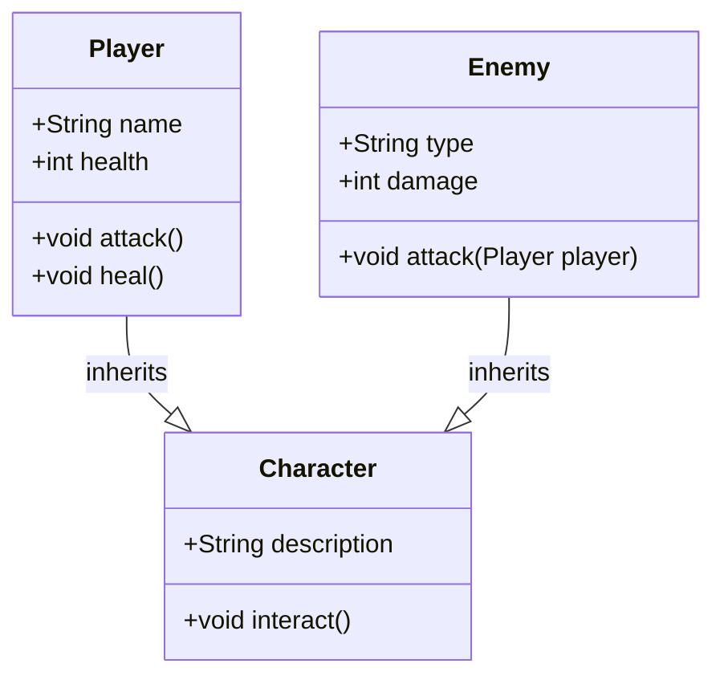

# Examples

```mermaid
classDiagram
    class Player {
        +String name
        +int health
        +void attack()
        +void heal()
    }

    class Enemy {
        +String type
        +int damage
        +void attack(Player player)
    }

    Player --|> Character : inherits
    Enemy --|> Character : inherits
    Character : +String description
    Character : +void interact()
```

