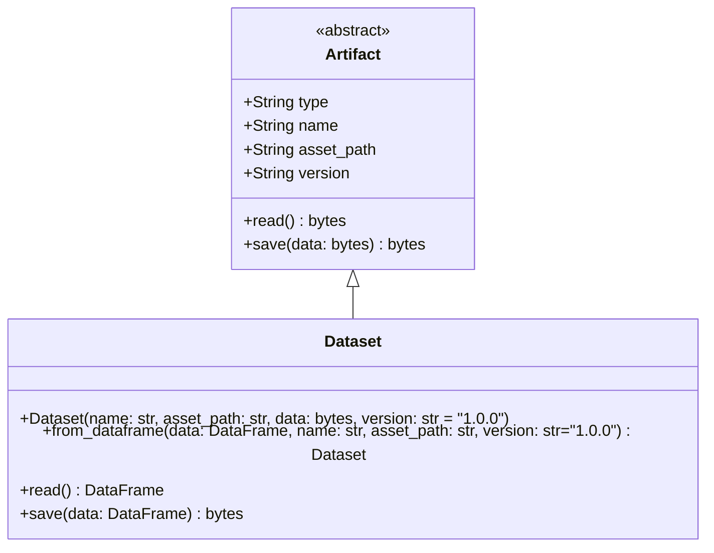

#DatasetClass



### Explanation of UML Class diagram
- **Artifact**: An abstract base class with attributes `type`, `name`, `asset_path`, and `version`. It has `read()` and `save()` methods.
- **Dataset**: Inherits from `Artifact` and includes:
  - **Constructor**: Sets up the `Dataset` type and initializes it using parameters passed through `Artifact`.
  - **Static Method** `from_dataframe`: Converts a DataFrame to a CSV in bytes and returns a `Dataset` instance.
  - **Overridden Methods**:
    - `read()`: Reads and decodes CSV data.
    - `save(data: DataFrame)`: Encodes and saves data as bytes through the parent `save` method.

This UML class diagram provides a clear view of the `Dataset` class's structure and inheritance from `Artifact`.
### Code
Luckily they give us the code. 
> **The parent class is an [[Artifact]]**
```python
from autoop.core.ml.artifact import Artifact
from abc import ABC, abstractmethod
import pandas as pd
import io

class Dataset(Artifact):

    def __init__(self, *args, **kwargs):
        super().__init__(type="dataset", *args, **kwargs)

    @staticmethod
    def from_dataframe(
		    data: pd.DataFrame, 
		    name: str, 
		    asset_path: str, 
		    version: str="1.0.0"
		):
        return Dataset(
            name=name,
            asset_path=asset_path,
            data=data.to_csv(index=False).encode(),
            version=version,
        )
        
    def read(self) -> pd.DataFrame:
        bytes = super().read()
        csv = bytes.decode()
        return pd.read_csv(io.StringIO(csv))
    
    def save(self, data: pd.DataFrame) -> bytes:
        bytes = data.to_csv(index=False).encode()
        return super().save(bytes)
    
```


A tabular data artefact split into `training` and `test sets`.
basically just
```python
self.parameters = {
            "observations": np.array(observations),
            "ground_truths": np.array(ground_truths),
        }
```

