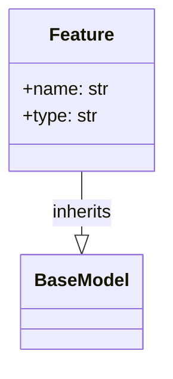

#Feature
**Info**

> More examples of this at [[Mermaid]]

# Test - test_detect_features_continuous
#Test
So we need to create a function called `detect_feature_types` and we need to the use `Artifacts` to store the data as. In this case each artifact will be saved as a [[Feature]] class
Lets break it down:

1 parameter: [[Dataset]]

```python
dataset = Dataset.from_dataframe(

            name="iris",

            asset_path="iris.csv",

            data=df,

        )
features = detect_feature_types(dataset)
```

Return `list`
```python
self.assertIsInstance(features, list)
```

Length `4` (in this test case)
```python
self.assertEqual(len(features), 4)
```

* Each feature needs to be of type [[Feature]]
* Needs a parameter called `name` and one called `type`
* `type` needs to be either "numerical" or "categorical"
```python
for feature in features:

            self.assertIsInstance(feature, Feature)

            self.assertEqual(feature.name in iris.feature_names, True)

            self.assertEqual(feature.type, "numerical")
```


# Test - test_detect_features_with_categories

```python
data = fetch_openml(name="adult", version=1, parser="auto")
```
> Retrieves a dataset `adult` from `sklearn.datasets`.  [[Adult Dataset]] <- ==preview== of dataset available
> 

```python
 df = pd.DataFrame(
            data.data,
            columns=data.feature_names,
        )
```
> Creates a [[pandas]] dataframe

```python
dataset = Dataset.from_dataframe(
            name="adult",
            asset_path="adult.csv",
            data=df,
        )
```
> Explained in [[#Test - test_detect_features_continuous]] (the previous heading)

```python
features = detect_feature_types(dataset)
self.assertIsInstance(features, list)
self.assertEqual(len(features), 14)
```
> creates [[Feature]]s
> ensures its a `list`
> makes sure its `length` is `14`

```python
numerical_columns = [
            "age",
            "education-num",
            "capital-gain",
            "capital-loss",
            "hours-per-week",
        ]
categorical_columns = [
            "workclass",
            "education",
            "marital-status",
            "occupation",
            "relationship",
            "race",
            "sex",
            "native-country",
        ]
```
> these are the `columns `that are `captured` for [[training]]
> **Numerical**:
> 	Age, Education, Capital gain, Capital loss, Hours per week
> **Categorical**:
>	Workclass, Education, Marital status, Occupation, Relationship, Race, Sex, Native country

```python
for feature in features:
            self.assertIsInstance(feature, Feature)
            self.assertEqual(feature.name in data.feature_names, True)
```
> Ensures all features are there

```python
for detected_feature in filter(lambda x: x.name in numerical_columns, features):
            self.assertEqual(detected_feature.type, "numerical")
for detected_feature in filter(lambda x: x.name in categorical_columns, features):
            self.assertEqual(detected_feature.type, "categorical")
```
> A couple of things are happening here:
1. the `filter()` function returns an `iterator` that can then be looped over
2. The `lambda` function is simply `looping` over the `features` and `numerical` columns from before and finding a `conjunction` between them.  
	1. more specifically, its is checking if `x.name` is in `numerical_columns`
3. The `assertEqual()` simply checks that there are then only numerical and categorical names.
4. 


